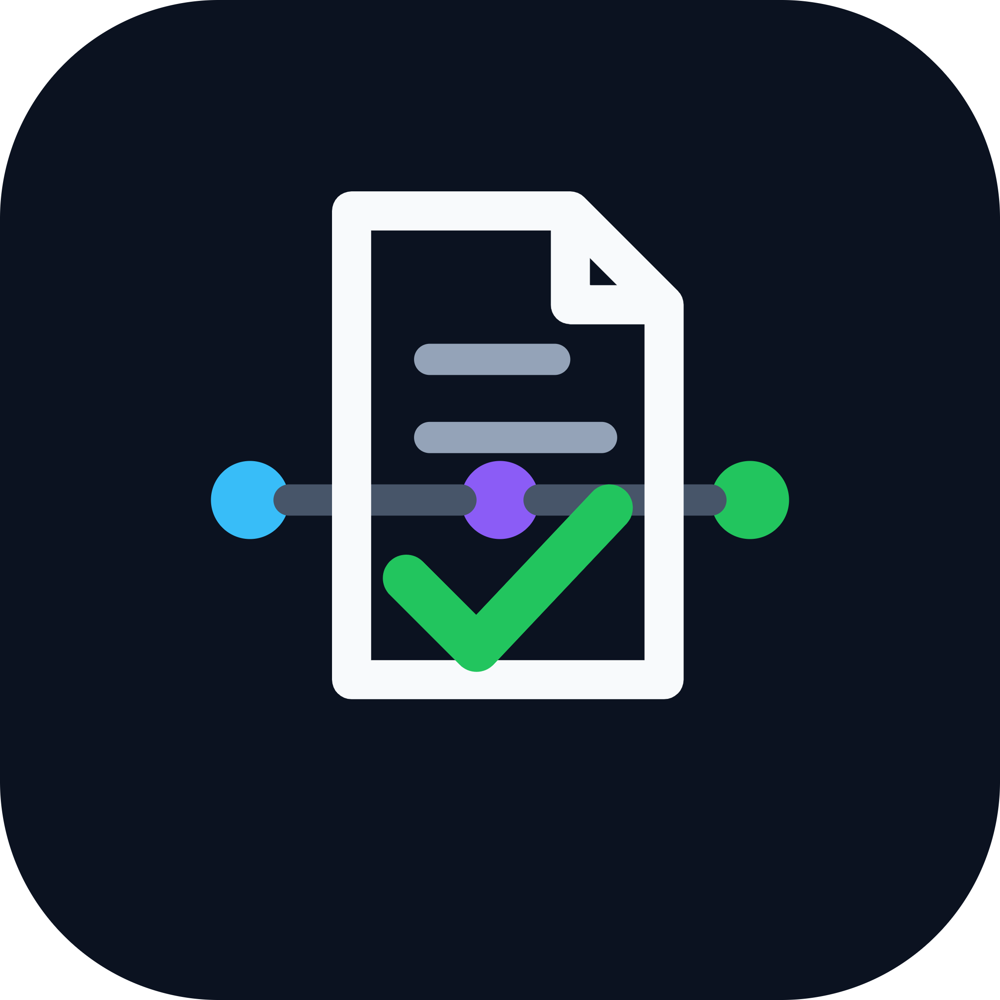

<p align="center">
  
</p>


<p align="center">
  <strong>Evidence-first PRD workflow for AI coding agents.</strong>
</p>

<p align="center">
  
  
  
  
  
</p>

# PRD Pipeline for AI Coding Agents

An evidence-first, PRD-driven software delivery workflow for local AI coding agents.

This project provides a structured command pipeline that turns a feature idea into:

* researched discovery
* PRD
* technical specification
* dependency plan
* isolated task files
* task validation report
* implementation commits
* specialist review
* final pull request

It is designed for serious brownfield development where vague prompts are not enough.


## Quick Start

```bash
# Clone the repository
git clone https://github.com/<your-org>/prd-pipeline.git
cd prd-pipeline

# Install for your agent runtime (see "Installation by Agent Runtime" below)
# Example for OpenCode (project-level):
mkdir -p .opencode/commands
cp prd-*.md .opencode/commands/

# Run the first command
/prd-discover "your feature idea"
```


## Why This Exists

AI coding agents are fast, but they are also literal.

If the specification is vague, the implementation will be vague.  
If the task is too large, the agent will drift.  
If the current codebase is not researched first, the agent may invent patterns that do not belong.

This pipeline solves that by forcing a disciplined sequence:

1. research before requirements
2. blast-radius analysis before technical design
3. dependency planning before tasks
4. task validation before implementation
5. codebase pattern reuse before new code
6. specialist review before PR
7. final verification before pull request

The goal is not more process.  
The goal is fewer wrong turns.


## Pipeline

```text
/prd-discover
  ↓
/prd-write
  ↓
/prd-plan
  ↓
/prd-tasks
  ↓
/prd-validate
  ↓
/prd-implement
  ↓
/prd-review
  ↓
/prd-pr
```

`/prd-validate` is treated as Step 4a. It is a quality gate between task generation and implementation.


## Commands

### 1\. `/prd-discover`

Research-first Socratic discovery.

**Input**

```bash
/prd-discover "external reviewer approval flow"
```

**Output**

```text
docs/prd/{feature-slug}-{date}/discovery.md
```

**What it does**

* assesses whether the feature should be decomposed
* researches the existing codebase before asking questions
* detects new feature vs enhancement
* maps blast radius across API, DB, auth, UI, workflow, integrations, tests, and rollback
* asks one precise grounded question at a time
* writes `discovery.md`


### 2\. `/prd-write`

Turns discovery into a PRD and technical specification.

**Input**

```bash
/prd-write docs/prd/{feature}/discovery.md
```

**Outputs**

```text
docs/prd/{feature}/prd.md
docs/prd/{feature}/spec.md
```

**What it does**

* reads `discovery.md`
* performs deeper codebase research
* verifies library APIs and implementation patterns
* performs blast-radius analysis
* writes a testable PRD
* writes a buildable technical spec
* captures compatibility requirements for enhancements


### 3\. `/prd-plan`

Turns the PRD and spec into a dependency graph.

**Input**

```bash
/prd-plan docs/prd/{feature}/prd.md docs/prd/{feature}/spec.md
```

Optional TDD mode:

```bash
/prd-plan docs/prd/{feature}/prd.md docs/prd/{feature}/spec.md --tdd
```

**Output**

```text
docs/prd/{feature}/plan.md
```

**What it does**

* validates PRD/spec assumptions against the live codebase
* maps files to create and modify
* builds the shortest safe dependency graph
* identifies critical path and parallel tracks
* adds compatibility Layer 0 for enhancements
* supports TDD RED → IMPL → GREEN → REFACTOR planning


### 4\. `/prd-tasks`

Turns the plan into one self-contained task file per implementation unit.

**Input**

```bash
/prd-tasks docs/prd/{feature}/plan.md
```

**Outputs**

```text
docs/prd/{feature}/tasks/index.md
docs/prd/{feature}/tasks/TASK-0-01.md
docs/prd/{feature}/tasks/TASK-1-01.md
...
```

**What it does**

* creates a lightweight TODO index
* creates one task file per task
* embeds task-specific code context
* defines exact files to create or modify
* defines exact acceptance checks
* defines commit instructions
* ensures every task can be executed by a fresh subagent
* hands off to `/prd-validate` before implementation


### 4a. `/prd-validate`

Validates generated tasks before implementation.

**Input**

```bash
/prd-validate docs/prd/{feature}/tasks/index.md
```

**Output**

```text
docs/prd/{feature}/tasks/validation.md
```

**What it does**

* checks task context isolation
* validates dependency graph correctness
* checks file path accuracy
* checks acceptance commands
* checks compatibility gates
* checks parallel safety
* checks live codebase references
* blocks implementation if generated tasks are not ready


### 5\. `/prd-implement`

Implements validated task files.

**Input**

```bash
/prd-implement docs/prd/{feature}/tasks/TASK-0-01.md
```

Parallel layer mode:

```bash
/prd-implement --parallel-layer 0
```

**What it does**

* reads one task file
* confirms dependencies are complete
* confirms `/prd-validate` passed
* finds the nearest existing codebase pattern
* writes the minimum code needed
* runs acceptance checks
* commits implementation
* updates `tasks/index.md`


### 6\. `/prd-review`

Runs parallel specialist review.

**Input**

```bash
/prd-review docs/prd/{feature}
```

**Review dimensions**

* spec compliance
* security
* performance
* TypeScript strictness
* code quality and architecture
* test coverage

**Output format**

```text
SEVERITY · CATEGORY · path/to/file.ts:LINE
  ✗ problem
  ✓ fix
```


### 7\. `/prd-pr`

Creates a pull request after all gates pass.

**Input**

```bash
/prd-pr
```

Optional target branch:

```bash
/prd-pr develop
```

**What it does**

* confirms current branch is a feature branch
* confirms all tasks are complete
* confirms task validation passed
* confirms review is clean
* runs final TypeScript and test checks
* builds a self-contained PR description
* pushes the feature branch
* opens the PR with GitHub CLI


## Required Tools

This workflow assumes a local AI coding agent that supports:

* Markdown slash commands or reusable Markdown skills
* MCP-style tools
* local shell execution
* Git operations
* reading and writing repository files

The exact tool names may vary by agent/runtime. The command files are written so you can adapt tool names to your environment.


## Required MCP / Research Tools

### 1\. Codebase symbol/navigation tool

Used for:

* finding symbols
* reading signatures
* tracing callers and dependencies
* understanding current architecture

Recommended capability names:

```text
find\_symbol
get\_symbol\_info
get\_related\_symbols
get\_overview
```

Example tool family used in these commands:

```text
mcp\_\_serena
```


### 2\. Code search and file reading tool

Used for:

* searching local code
* reading exact file contents
* reading relevant snippets
* inspecting changed files or pull request context
* researching public GitHub implementations

Recommended capability names:

```text
localSearchCode
localGetFileContent
localViewStructure
localFindFiles
ghSearchCode
ghGetFileContent
ghSearchPRs
ghSearchRepos
```

Example tool family used in these commands:

```text
mcp\_\_octocode
```

Notes:


* If your OctoCode installation exposes PR inspection, use that for PR changed files.
* If no PR context exists, local `git diff` may still be needed for changed-file detection.
* Prefer tool-schema discovery when your agent supports it.


### 3\. Semantic code search tool

Used for:

* finding conceptually related code
* discovering behavior with different names
* finding adjacent modules and hidden coupling

Recommended capability names:

```text
semantic search
find related
concept search
```

Example tool family used in these commands:

```text
mcp\_\_semble
```


### 4\. Library documentation tool

Used for:

* verifying library APIs
* checking exact method signatures
* avoiding implementation from memory
* validating version-specific behavior

Recommended capability names:

```text
resolve\_library\_id
get\_library\_docs
```

Example tool family used in these commands:

```text
mcp\_\_context7
```


### 5\. Shell / Bash access

Used for:

* creating folders
* writing files
* running type checks
* running tests
* running builds
* Git operations
* GitHub CLI PR creation

Required commands may include:

```bash
mkdir
cat
ls
find
grep
git
bun
pnpm
npx
tsc
gh
```

You can adjust commands for your package manager.


## Optional Tools

These are useful but not mandatory:

* GitHub CLI (`gh`) for `/prd-pr`
* GitHub authentication for remote repository research
* language server support for stronger semantic navigation
* test runner support for scoped task acceptance checks


## Repository Layout

```text
.
├── README.md
├── LICENSE
├── assets/
│   └── logo.png
├── prd-discover.md
├── prd-write.md
├── prd-plan.md
├── prd-tasks.md
├── prd-validate.md
├── prd-implement.md
├── prd-review.md
├── prd-pr.md
├── prd-ponytail-audit.md
└── prd-ponytail-review.md
```


## Output Structure

A typical generated feature folder looks like this:

```text
docs/prd/external-reviewer-28-06-2026/
├── discovery.md
├── prd.md
├── spec.md
├── plan.md
└── tasks/
    ├── index.md
    ├── validation.md
    ├── TASK-0-01.md
    ├── TASK-0-02.md
    ├── TASK-1-01.md
    └── TASK-CUTOVER-01.md
```


## Installation by Agent Runtime

This repository is a collection of Markdown command files. Different agent runtimes load reusable commands/skills from different folders.

The command files are portable, but you may need to adjust frontmatter, tool names, or MCP names for your local runtime.


### Claude Code

Claude Code supports project-level custom slash commands as Markdown files in:

```text
.claude/commands/
```

It also supports personal commands in:

```text
\~/.claude/commands/
```

A Markdown filename becomes the slash command name.

Install from this repository:

```bash
git clone https://github.com/<your-org>/prd-pipeline.git
cd prd-pipeline
mkdir -p /path/to/your/project/.claude/commands
cp prd-\*.md /path/to/your/project/.claude/commands/
```

Or for personal (global) commands:

```bash
mkdir -p \~/.claude/commands
cp prd-\*.md \~/.claude/commands/
```

Expected structure:

```text
.claude/commands/
├── prd-discover.md
├── prd-write.md
├── prd-plan.md
├── prd-tasks.md
├── prd-validate.md
├── prd-implement.md
├── prd-review.md
├── prd-pr.md
├── prd-ponytail-audit.md
└── prd-ponytail-review.md
```

Run:

```bash
/prd-discover "your feature idea"
```


### OpenCode

OpenCode supports custom commands as Markdown files in:

```text
.opencode/commands/
```

for project commands, and:

```text
\~/.config/opencode/commands/
```

for global commands. The Markdown filename becomes the command name, and command templates can use `$ARGUMENTS` and positional placeholders such as `$1`, `$2`, and `$3`.

Install from this repository:

```bash
git clone https://github.com/<your-org>/prd-pipeline.git

# Project-level install
cd /path/to/your/project
mkdir -p .opencode/commands
cp /path/to/prd-pipeline/prd-\*.md .opencode/commands/

# Or global install
mkdir -p \~/.config/opencode/commands
cp /path/to/prd-pipeline/prd-\*.md \~/.config/opencode/commands/
```

Expected structure:

```text
.opencode/commands/
├── prd-discover.md
├── prd-write.md
├── prd-plan.md
├── prd-tasks.md
├── prd-validate.md
├── prd-implement.md
├── prd-review.md
├── prd-pr.md
├── prd-ponytail-audit.md
└── prd-ponytail-review.md
```

Run:

```bash
/prd-discover "your feature idea"
```


### Codex CLI

Codex custom prompts are documented as deprecated by OpenAI. OpenAI recommends using skills for reusable instructions.

Install from this repository:

```bash
git clone https://github.com/<your-org>/prd-pipeline.git

# If using Codex skills (recommended):
# Adapt command files into Codex skills manually.

# Legacy custom prompts (deprecated):
mkdir -p \~/.codex/prompts
cp /path/to/prd-pipeline/prd-\*.md \~/.codex/prompts/
```

Important limitations:

* Custom prompts are deprecated.
* Codex scans only top-level Markdown files in `\~/.codex/prompts`.
* Restart Codex or open a new chat after editing prompt files.


### Antigravity CLI

Antigravity documentation describes an extensibility model based on Plugins and Skills. A plugin bundle is staged under:

```text
\~/.gemini/antigravity-cli/plugins/<plugin\_name>/
```

A plugin may contain:

```text
plugin.json
mcp\_config.json
hooks.json
skills/
agents/
rules/
```

Suggested plugin layout:

```text
\~/.gemini/antigravity-cli/plugins/prd-pipeline/
├── plugin.json
└── skills/
    ├── prd-discover.md
    ├── prd-write.md
    ├── prd-plan.md
    ├── prd-tasks.md
    ├── prd-validate.md
    ├── prd-implement.md
    ├── prd-review.md
    └── prd-pr.md
```

Example `plugin.json`:

```json
{
  "$schema": "https://antigravity.google/schemas/v1/plugin.json",
  "name": "prd-pipeline",
  "description": "Evidence-first PRD pipeline commands for agentic software development."
}
```

Install from this repository:

```bash
git clone https://github.com/<your-org>/prd-pipeline.git
mkdir -p \~/.gemini/antigravity-cli/plugins/prd-pipeline/skills
cp /path/to/prd-pipeline/prd-\*.md \~/.gemini/antigravity-cli/plugins/prd-pipeline/skills/
cat > \~/.gemini/antigravity-cli/plugins/prd-pipeline/plugin.json <<'EOF'
{
  "$schema": "https://antigravity.google/schemas/v1/plugin.json",
  "name": "prd-pipeline",
  "description": "Evidence-first PRD pipeline commands for agentic software development."
}
EOF
```

Then restart or reload Antigravity CLI so it can discover the plugin/skills.


### Generic Markdown Command Agents

For agents that support Markdown slash commands but use a different folder:

1. Clone this repository:
   ```bash
   git clone https://github.com/<your-org>/prd-pipeline.git
   ```
2. Create the runtime's command/skill directory.
3. Copy each `prd-\*.md` file from the cloned repo into that directory.
4. Confirm filenames map to slash commands.
5. Update tool names in frontmatter if your MCP names differ.
6. Run `/prd-discover "feature idea"`.

Minimum required files:

```text
prd-discover.md
prd-write.md
prd-plan.md
prd-tasks.md
prd-validate.md
prd-implement.md
prd-review.md
prd-pr.md
```


## Recommended Workflow

```bash
/prd-discover "external reviewer approval flow"

/prd-write docs/prd/external-reviewer-28-06-2026/discovery.md

/prd-plan docs/prd/external-reviewer-28-06-2026/prd.md docs/prd/external-reviewer-28-06-2026/spec.md

/prd-tasks docs/prd/external-reviewer-28-06-2026/plan.md

/prd-validate docs/prd/external-reviewer-28-06-2026/tasks/index.md

/prd-implement docs/prd/external-reviewer-28-06-2026/tasks/TASK-0-01.md

/prd-review docs/prd/external-reviewer-28-06-2026

/prd-pr
```


## Core Principles

### Evidence Before Assumptions

Every technical detail should come from one of:

* existing local codebase
* verified library documentation
* real implementation examples
* explicit user decisions

If evidence is missing, the agent must research more or mark the item as unverified.


### Blast Radius Before Specification

Before writing requirements or implementation plans, the system asks:

* What API routes may change?
* What DB tables or models are affected?
* What auth/security boundaries are involved?
* What UI surfaces are affected?
* What workflows, jobs, events, or integrations may break?
* What tests protect existing behavior?
* What makes rollback safe or unsafe?


### Compatibility First for Enhancements

Enhancements are treated as risky by default.

The system identifies:

* frozen contracts
* current callers
* existing persisted data
* current user-facing behavior
* rollback constraints
* cutover criteria

Layer 0 compatibility tasks must pass before implementation begins.


### One Task, One Commit

Each task file represents:

* one implementation unit
* one acceptance check
* one commit
* one clear rollback boundary

No task should require reading the PRD, spec, plan, or another task before starting.


### Ponytail Discipline

The pipeline follows a “lazy senior engineer” mindset:

1. Does this need to exist?
2. Can existing code do it?
3. Can the standard library do it?
4. Can the platform do it?
5. Can an installed dependency do it?
6. Can it be one line?
7. Only then: write the minimum safe code.

The system is never lazy about:

* security
* input validation
* auth
* data loss
* accessibility
* compatibility contracts
* explicit PRD requirements
* tests for non-trivial behavior


## When To Use This

Use this workflow for:

* brownfield features
* complex product work
* multi-file changes
* security-sensitive features
* workflow/state-machine changes
* DB/schema work
* compatibility-sensitive enhancements
* multi-agent implementation

Avoid this workflow for:

* tiny one-line fixes
* throwaway scripts
* purely cosmetic copy changes
* experiments where process cost exceeds risk


## Design Goals

This system optimizes for:

* fewer hallucinated implementation details
* fewer broken existing contracts
* better task isolation
* better parallel execution
* easier review
* safer PR creation
* stronger traceability from requirement to code

It is intentionally more rigorous than a lightweight prompt-to-code workflow.


## Related Projects

* [Ponytail](https://github.com/DietrichGebert/ponytail) — lazy senior developer rules for AI coding agents.
* [Superpowers](https://github.com/obra/superpowers) — agentic skills framework and software-development methodology.
* [GitHub Spec Kit](https://github.com/github/spec-kit) — toolkit for spec-driven development.
* [OpenSpec](https://github.com/Fission-AI/OpenSpec) — lightweight spec-driven development framework for AI coding assistants.


## Acknowledgements

This project is inspired by the broader agentic software-development community and the people building practical workflows for AI-assisted engineering.

Special thanks to:

* [Ponytail](https://github.com/DietrichGebert/ponytail) for the “lazy senior engineer” discipline: prefer the smallest safe solution, reuse what already exists, avoid unnecessary abstractions, and remember that the best code is the code you never had to write.
* [Superpowers](https://github.com/obra/superpowers) for demonstrating how composable skills can turn AI coding agents into structured software-development collaborators.
* The spec-driven development community, including tools and workflows such as GitHub Spec Kit, OpenSpec, Claude Code SDD workflows, and other public experiments that helped popularize explicit artifacts for intent, design, tasks, implementation, review, and verification.

This project is not affiliated with Ponytail, Superpowers, GitHub Spec Kit, OpenSpec, Anthropic, Google, OpenAI, OpenCode, or any MCP/tool provider unless stated otherwise.


## License

This project is licensed under the MIT License — see the [LICENSE](./LICENSE) file for details.


## Status

Experimental but production-oriented.

Use carefully, inspect generated artifacts, and adapt the commands to your codebase conventions.
